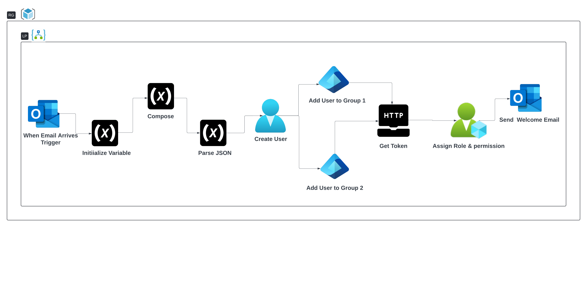

# HireSync: Revolutionize Employee Onboarding with Azure Automation

## Azure Services Used:

1. Azure AD
2. Azure Logic Apps
3. Azure Email Service (part of Logic Apps connector)
4. Azure Resource Manager

## Overview

Welcome to **HireSync**, the ultimate solution for automating the employee onboarding process. By harnessing the power of Azure Logic Apps, this project transforms how new employees are onboarded into Azure AD and assigned the necessary Azure resources. Say goodbye to manual processes and hello to efficiency, consistency, and a streamlined onboarding experience.

## What is Azure Logic Apps?

Azure Logic Apps is a cloud service designed to simplify the automation and orchestration of tasks, business processes, and workflows. Whether you're integrating apps, data, systems, or services across enterprises or organizations, Azure Logic Apps lets you create sophisticated workflows that handle everything from simple email notifications to complex, multi-system processes.

## Project Overview

1. **Trigger and Initialize Variables**
2. **Parsing Email Content**
3. **Creating a User in Entra ID**
4. **Conditional Logic for Group Assignment**
5. **Adding User to Groups**
6. **Provisioning Resources using ARM**
7. **Sending Welcome Email**
8. **Monitoring and Review**

## Step-by-Step Implementation

### 1. Trigger and Initialize Variables

**Objective**: Kick off the workflow upon receiving an email about a new hire and initialize variables to capture the email content.

**Actions**:
- **Configure Email Trigger**: Set up an email trigger in Azure Logic Apps that activates when an email is received at a specific mailbox indicating a new hire.
- **Initialize Variables**: Create variables to store the email body content and other relevant information that will be parsed and used in subsequent steps.

### 2. Parsing Email Content

**Objective**: Extract vital details from the email, such as the new hire's first name, last name, email, job position, and department.

**Actions**:
- **Use Compose Action**: Implement the Compose action in Logic Apps to parse the email content. Extract the required details using expressions and string manipulation functions.

### 3. Creating a User in Entra ID

**Objective**: Seamlessly create a new user in Entra ID using the extracted details.

**Actions**:
- **Use Entra ID Connector**: Employ the Entra ID (Azure AD) connector within Logic Apps to automatically create a new user profile. Populate the user details with the parsed information from the email.

### 4. Conditional Logic for Group Assignment

**Objective**: Assign the new user to appropriate groups based on their job position.

**Actions**:
- **Implement Conditional Logic**: Set up conditional statements to evaluate the job position and determine the appropriate group assignments.
- **Add to Groups**: Use the Entra ID connector to add the new user to the determined groups based on the evaluated conditions.

### 5. Adding User to Groups

**Objective**: Ensure the new user is added to all necessary groups for their role.

**Actions**:
- **Group Addition**: Extend the Logic App workflow to include additional group assignments if necessary, ensuring the user is added to all relevant groups for their role.

### 6. Provisioning Resources using ARM

**Objective**: Automatically provision necessary Azure resources for the new hire.

**Actions**:
- **Call ARM API**: Utilize an HTTP action in Logic Apps to call the Azure Resource Manager (ARM) API. This will provision the required resources, such as virtual machines or specific permissions, based on predefined templates.

### 7. Sending Welcome Email

**Objective**: Send a personalized welcome email to the new hire with their login credentials and essential instructions.

**Actions**:
- **Leverage Outlook Connector**: Use the Outlook connector in Logic Apps to craft and send a customized welcome email. Include login credentials, access instructions, and any other relevant information for the new hire.

### 8. Monitoring and Review

**Objective**: Maintain a smooth onboarding process by monitoring and reviewing the workflow.

**Actions**:
- **Monitor Runs History**: Regularly check the Logic Apps runs history to ensure that all steps are executed as expected.
- **Review Azure AD Logs**: Periodically review Azure AD logs to verify that users are being created correctly, groups are assigned accurately, and resources are provisioned without issues.

## Testing the Logic App

**Objective**: Validate the Logic App to ensure flawless operation.

**Actions**:
- **Simulate New Hire Email**: Test the workflow by sending a sample new hire email to the configured mailbox.
- **Verify Each Step**: Confirm that the new user is created in Entra ID, assigned the correct roles and groups, provisioned the necessary resources, and sent a welcome email.

## Overcoming Challenges

### Email Content Parsing

**Challenge**: Parsing HTML-formatted email content in Azure Logic Apps.

**Solution**: Utilized the Compose action with string functions to effectively clean and extract information from the HTML content.

### User Role Assignment

**Challenge**: Correctly assigning roles and groups based on job position.

**Solution**: Implemented conditional logic to dynamically evaluate job positions and assign appropriate groups.

### Resource Provisioning Permissions

**Challenge**: Managing permissions for Azure Resource Manager (ARM) during resource provisioning.

**Solution**: Configured HTTP actions to securely call ARM APIs and assign necessary roles, ensuring Logic App permissions are correctly handled.

### Managing Credentials and Tokens

**Challenge**: Securely handling authentication tokens for API calls.

**Solution**: Set up the Logic App to securely retrieve and use authentication tokens for interactions with Entra ID and ARM.

### Configuration
Before deploying this logic app, replace the following placeholders in the logic-app-definition.json file with the actual values from your Azure environment:

1. {client-id}
2. {tenant-id}
3. {group-id-cloud-engineer}
4. {group-id-data-analyst}
5. {subscription-id}
6. {resource-group-name}
7. {client-secret}

By following this guide, you can transform your employee onboarding process into a model of efficiency and consistency. Welcome to the future of onboarding with **HireSync** – where automation meets excellence.

